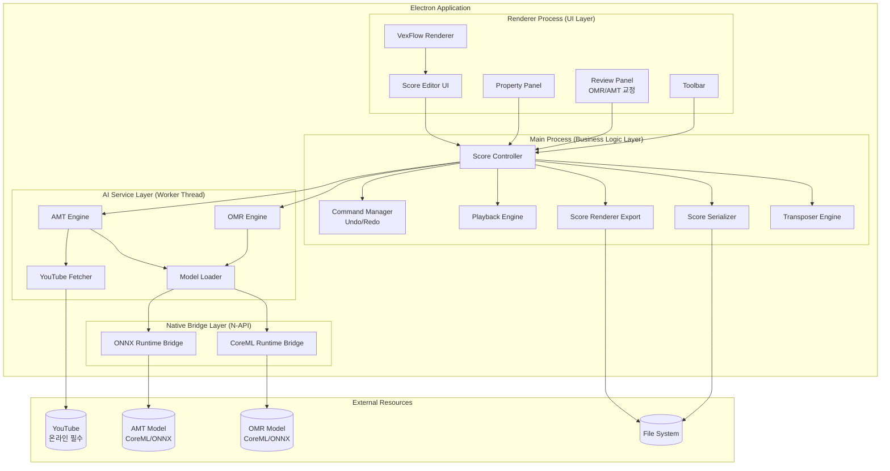
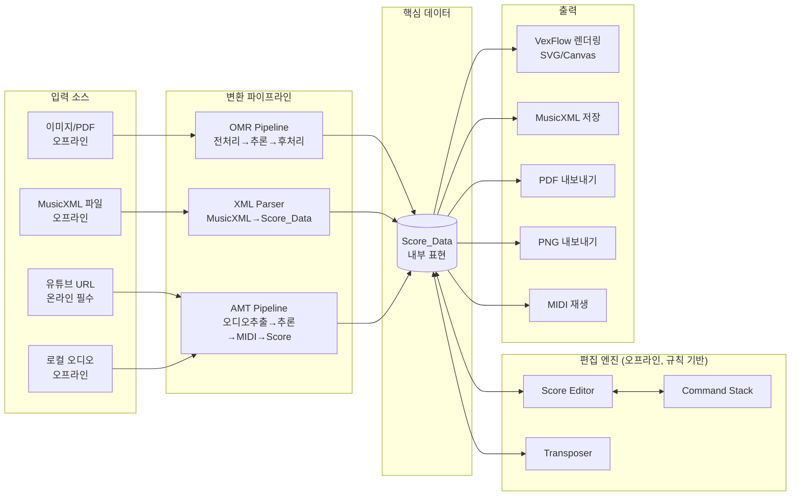
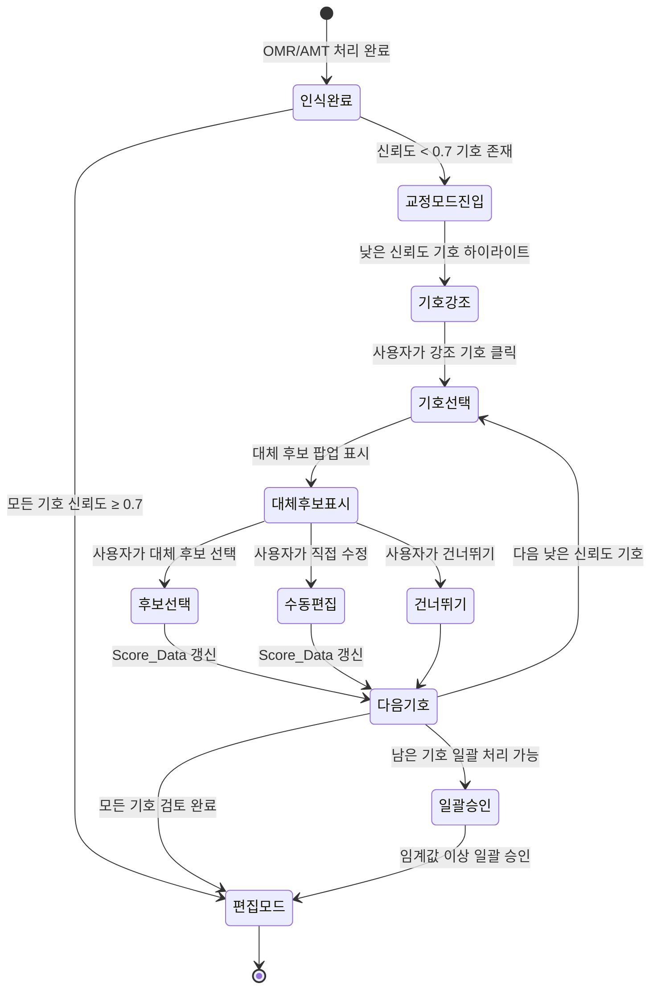

# Sheet Music Studio - 기술 설계 문서

## 개요 (Overview)

Sheet Music Studio는 Electron 기반 크로스플랫폼 데스크톱 애플리케이션으로, 악보 인식(OMR), 편집, 조 변환, 저장/내보내기, 자동 채보(AMT), 재생 기능을 통합 제공한다.

### 핵심 기능의 오프라인/온라인 분리

| 기능 영역 | 네트워크 요구 | 설명 |
|-----------|-------------|------|
| 악보 편집, 조 변환, 저장/내보내기 | **오프라인** | 규칙 기반 로직, 네트워크 불필요 |
| OMR 악보 인식 | **오프라인** | CoreML/ONNX 로컬 추론 |
| AMT 자동 채보 (로컬 오디오) | **오프라인** | CoreML/ONNX 로컬 추론 |
| 유튜브 오디오 추출 | **온라인 필수** | YouTube 서버 접근 필요 |
| 악보 재생 (MIDI) | **오프라인** | Web Audio API 로컬 합성 |

핵심 편집 및 AI 추론 기능은 완전히 오프라인으로 동작하며, 유튜브 기반 채보 기능만 네트워크 연결을 필요로 한다.

### 기술 스택 결정

| 영역 | 기술 선택 | 근거 |
|------|-----------|------|
| 애플리케이션 프레임워크 | **Electron + TypeScript** | 아래 상세 근거 참조 |
| 악보 렌더링 | VexFlow (TypeScript) | 오픈소스 악보 렌더링 라이브러리, SVG/Canvas 지원, chord/tie/slur/beam/grace note 지원 |
| AI 추론 런타임 | CoreML (우선) / ONNX Runtime | Apple Neural Engine 활용, 로컬 추론 최적화 |
| OMR 모델 | CNN 기반 경량 모델 (oemer 아키텍처 참고) | End-to-end OMR, MusicXML 출력, CoreML 변환 가능 |
| AMT 모델 | Basic Pitch (Spotify) | 경량 AMT 모델, CoreML/ONNX 지원, TypeScript 바인딩 존재 |
| MusicXML 처리 | 커스텀 TypeScript 파서/시리얼라이저 | MusicXML 3.1 표준 준수, Score_Data 양방향 변환 |
| PDF 처리 | pdf.js (PDF→이미지), PDFKit (이미지→PDF) | Electron 환경 호환 |
| 유튜브 오디오 추출 | yt-dlp (Python subprocess) | 안정적인 유튜브 오디오 추출, WAV 변환 지원 |
| MIDI 재생 | Tone.js / Web Audio API | 브라우저 기반 MIDI 합성, 저지연 재생 |
| 네이티브 브릿지 | node-addon-api (N-API) | CoreML 런타임 호출을 위한 네이티브 바인딩 |

#### Electron vs Swift/AppKit 선택 근거

**Electron을 선택한 이유:**

1. **VexFlow 통합**: 악보 렌더링의 핵심인 VexFlow는 TypeScript/JavaScript 라이브러리로, Electron 환경에서 네이티브하게 동작한다. Swift/AppKit에서는 WKWebView를 통한 간접 호출이 필요하여 렌더링 성능과 인터랙션 복잡도가 증가한다.
2. **Basic Pitch TypeScript 바인딩**: Spotify의 basic-pitch-ts가 존재하여 AMT 파이프라인의 전처리/후처리를 TypeScript로 통합 가능하다.
3. **MusicXML 파싱**: TypeScript/JavaScript 생태계에 XML 파싱 라이브러리가 풍부하여 MusicXML 3.1 파서 구현이 용이하다.
4. **크로스플랫폼 확장성**: 향후 Windows/Linux 지원 가능성을 열어둔다.

**Swift/AppKit 대비 트레이드오프:**

- 메모리 사용량이 Electron 특성상 더 높다 (Chromium 런타임 ~200-400MB 추가). 그러나 Target_Hardware의 16GB 통합 메모리에서 8GB 앱 메모리 상한 내에서 충분히 수용 가능하다.
- UI 반응성은 Swift 네이티브 대비 다소 낮을 수 있으나, VexFlow의 Canvas/SVG 렌더링이 30fps 이상을 충족한다.
- CoreML 호출은 node-addon-api를 통한 네이티브 브릿지로 수행하며, 추론 자체는 Apple Neural Engine에서 실행되므로 브릿지 오버헤드는 무시할 수준이다.

### 성능/품질 목표 수치

| 지표 | 목표값 | 측정 조건 |
|------|--------|----------|
| PDF 5페이지 인식 시간 | ≤ 150초 (페이지당 30초) | Target_Hardware, CoreML Runtime |
| 3분 유튜브 오디오 채보 시간 | ≤ 360초 (오디오 길이의 2배) | Target_Hardware, CoreML Runtime |
| 전체 앱 메모리 상한 | ≤ 8GB | AI 추론 포함 |
| AI 모델 메모리 (단일) | ≤ 4GB (AMT), ≤ 2GB (OMR) | 동시 로드 금지 |
| MusicXML round-trip 성공률 | ≥ 99.5% | Score_Data 필드 단위 일치 |
| OMR note-level 정확도 | ≥ 0.85 F1 | 인쇄 악보 기준, pitch + duration 일치 |
| AMT note-level 정확도 | ≥ 0.75 F1 | 단일 악기 오디오 기준, onset ±50ms, pitch ±1 semitone |
| 1페이지 악보 렌더링 | ≤ 1초 | VexFlow SVG 출력 |
| 편집 반응 시간 | ≤ 100ms | 음표 추가/삭제/수정 |
| 조 변환 시간 | ≤ 500ms | 100마디 기준 |
| UI 프레임 레이트 | ≥ 30fps | 편집/탐색 중 |
| 앱 시작 시간 (모델 제외) | ≤ 5초 | Cold start |
| AI 모델 로드 시간 | ≤ 10초 | CoreML 모델 초기 로드 |

### 리서치 요약

- **OMR 기술**: oemer 프로젝트는 CNN 기반 end-to-end OMR 시스템으로, 악보 이미지에서 직접 MusicXML을 생성한다. 세그멘테이션 + 분류 파이프라인 구조를 사용하며, CoreML로 변환 가능한 PyTorch 모델을 기반으로 한다. 최근 연구에서 인쇄 악보 기준 pitch accuracy 0.96, duration accuracy 0.92 수준이 보고되었다. ([oemer GitHub](https://github.com/BreezeWhite/oemer), [MDPI Applied Sciences](https://www.mdpi.com/2076-3417/9/13/2645/htm))
- **AMT 기술**: Spotify의 Basic Pitch는 경량 신경망 기반 AMT 라이브러리로, CoreML, TensorFlow, ONNX 등 다양한 런타임을 지원한다. TypeScript 버전(basic-pitch-ts)도 제공된다. 다악기 지원과 높은 정확도를 경량 모델로 달성한다. ([Basic Pitch](https://basicpitch.spotify.com/), [basic-pitch-ts GitHub](https://github.com/spotify/basic-pitch-ts))
- **악보 렌더링**: VexFlow는 TypeScript 기반 오픈소스 악보 렌더링 라이브러리로, SVG와 Canvas 출력을 지원한다. Chord, beam, tie, slur, grace note, tuplet 등 풍부한 음악 기호를 지원하며, SMuFL 폰트 시스템을 사용한다. ([VexFlow GitHub](https://github.com/0xfe/vexflow))
- **MusicXML**: W3C Music Notation Community Group이 관리하는 표준 포맷으로, chord, tie, slur, beam, voice, grace note, repeat, articulation, pedal, fingering, ornament 등 풍부한 음악 요소를 표현한다. ([MusicXML 공식](https://www.musicxml.com/))


## 아키텍처 (Architecture)

### High-Level 아키텍처



### 데이터 흐름 아키텍처



### 레이어 구조

시스템은 4개의 레이어로 구성된다:

1. **UI Layer (Renderer Process)**: VexFlow 기반 악보 렌더링, 사용자 인터랙션, OMR/AMT 교정 패널
2. **Business Logic Layer (Main Process)**: Score_Data 조작, 조 변환, 직렬화, 재생 로직 (모두 규칙 기반)
3. **AI Service Layer (Worker Thread)**: OMR/AMT 모델 추론 파이프라인, 유튜브 오디오 추출
4. **Native Bridge Layer (N-API)**: CoreML/ONNX Runtime 네이티브 바인딩

레이어 간 통신은 Electron IPC(Inter-Process Communication)를 통해 이루어지며, AI 추론은 Worker Thread에서 비동기로 실행하여 UI 블로킹을 방지한다.


## 컴포넌트 및 인터페이스 (Components and Interfaces)

### 1. Score Controller (Main Process)

시스템의 중앙 조정자로, UI 이벤트를 받아 적절한 비즈니스 로직 모듈에 위임한다.

```typescript
interface IScoreController {
  // 파일 입출력
  openFile(path: string): Promise<ScoreDocument>;
  saveFile(path: string, format: ExportFormat): Promise<void>;
  importImage(path: string): Promise<ScoreDocument>;
  importPdf(path: string): Promise<ScoreDocument>;
  importYouTube(url: string, instrument?: InstrumentType): Promise<ScoreDocument>;

  // 편집 위임
  executeCommand(command: EditCommand): void;
  undo(): void;
  redo(): void;

  // 조 변환 위임
  transpose(semitones: number, range?: MeasureRange): void;

  // 재생 위임
  play(): void;
  pause(): void;
  stop(): void;
  setTempo(bpm: number): void;

  // 상태 조회
  getDocument(): ScoreDocument;
  getUndoStack(): EditCommand[];
  getRedoStack(): EditCommand[];
}
```

### 2. OMR Engine (Worker Thread)

이미지/PDF에서 악보를 인식하는 AI 파이프라인이다.

```typescript
interface IOMREngine {
  // 모델 관리
  loadModel(runtime: 'coreml' | 'onnx'): Promise<ModelStatus>;
  unloadModel(): Promise<void>;
  getModelStatus(): ModelStatus;

  // 인식 파이프라인
  recognizeImage(imageBuffer: ArrayBuffer): Promise<OMRResult>;
  recognizePdf(pdfBuffer: ArrayBuffer): Promise<OMRResult>;

  // 진행 상태
  onProgress(callback: (progress: OMRProgress) => void): void;
}

interface OMRResult {
  scoreData: ScoreData;
  confidence: SymbolConfidence[];
  failedRegions: BoundingBox[];
  processingTimeMs: number;
}

interface OMRProgress {
  stage: 'preprocessing' | 'inference' | 'postprocessing';
  currentPage: number;
  totalPages: number;
  percent: number;
}

interface SymbolConfidence {
  symbolId: string;
  type: SymbolType;
  confidence: number; // 0.0 ~ 1.0
  boundingBox: BoundingBox;
  alternatives?: AlternativeSymbol[]; // 대체 후보 목록
}

interface AlternativeSymbol {
  type: SymbolType;
  confidence: number;
  preview?: string; // 미리보기용 기호 식별자
}
```

### 3. AMT Engine (Worker Thread)

오디오에서 악보를 생성하는 AI 파이프라인이다.

```typescript
interface IAMTEngine {
  // 모델 관리
  loadModel(runtime: 'coreml' | 'onnx'): Promise<ModelStatus>;
  unloadModel(): Promise<void>;
  getModelStatus(): ModelStatus;

  // 채보 파이프라인
  transcribe(audioBuffer: ArrayBuffer, options?: AMTOptions): Promise<AMTResult>;

  // 진행 상태
  onProgress(callback: (progress: AMTProgress) => void): void;
}

interface AMTOptions {
  instrument?: InstrumentType;
  minConfidence?: number;
  tempoHint?: number;
}

interface AMTResult {
  scoreData: ScoreData;
  confidence: NoteConfidence[];
  detectedTempo: number;
  detectedKey: KeySignature;
  processingTimeMs: number;
}

interface NoteConfidence {
  noteId: string;
  confidence: number; // 0.0 ~ 1.0
  alternatives?: AlternativeNote[];
}

interface AlternativeNote {
  pitch: Pitch;
  duration: Duration;
  confidence: number;
}
```

### 4. YouTube Fetcher

유튜브 영상에서 오디오를 추출한다. 네트워크 연결이 필수이다.

```typescript
interface IYouTubeFetcher {
  // URL 검증
  validateUrl(url: string): Promise<VideoInfo>;

  // 오디오 추출
  extractAudio(url: string): Promise<AudioBuffer>;

  // 진행 상태
  onProgress(callback: (progress: FetchProgress) => void): void;
}

interface VideoInfo {
  title: string;
  durationSeconds: number;
  isAccessible: boolean;
}

interface FetchProgress {
  stage: 'downloading' | 'converting';
  percent: number;
}
```

### 5. Transposer

규칙 기반 조 변환 엔진이다.

```typescript
interface ITransposer {
  // 조 변환
  transpose(scoreData: ScoreData, semitones: number, range?: MeasureRange): ScoreData;

  // 조 정보 조회
  detectKey(scoreData: ScoreData): KeySignature;
  getTargetKey(currentKey: KeySignature, semitones: number): KeySignature;
}

interface MeasureRange {
  startMeasure: number; // 1-based
  endMeasure: number;   // inclusive
}
```

### 6. Score Serializer

Score_Data와 MusicXML 간 양방향 변환을 수행한다.

```typescript
interface IScoreSerializer {
  // MusicXML 직렬화/역직렬화
  toMusicXML(scoreData: ScoreData): string;
  fromMusicXML(xml: string): ScoreData;

  // 검증
  validateMusicXML(xml: string): ValidationResult;
}

interface ValidationResult {
  isValid: boolean;
  errors: ValidationError[];
}
```

### 7. Score Renderer (Export)

Score_Data를 PDF/PNG로 내보내는 모듈이다. UI 렌더링(VexFlow)과는 별도로, 파일 출력용 렌더링을 담당한다.

```typescript
interface IScoreRendererExport {
  toPdf(scoreData: ScoreData, options?: RenderOptions): Promise<Buffer>;
  toPng(scoreData: ScoreData, options?: RenderOptions): Promise<Buffer>;
}

interface RenderOptions {
  pageSize?: 'A4' | 'Letter';
  margin?: number;
  scale?: number;
}
```

### 8. Command Manager (Undo/Redo)

Command 패턴 기반의 편집 이력 관리자이다.

```typescript
interface ICommandManager {
  execute(command: EditCommand): void;
  undo(): EditCommand | null;
  redo(): EditCommand | null;
  canUndo(): boolean;
  canRedo(): boolean;
  clear(): void;
}

// Command 패턴
interface EditCommand {
  type: EditCommandType;
  execute(scoreData: ScoreData): ScoreData;
  undo(scoreData: ScoreData): ScoreData;
  description: string;
}

type EditCommandType =
  | 'addNote' | 'deleteNote' | 'modifyNote'
  | 'addRest' | 'deleteRest'
  | 'addMeasure' | 'deleteMeasure' | 'copyMeasure' | 'pasteMeasure'
  | 'changeTimeSignature' | 'changeKeySignature' | 'changeClef'
  | 'addDynamic' | 'deleteDynamic'
  | 'addLyric' | 'modifyLyric' | 'deleteLyric'
  | 'addArticulation' | 'deleteArticulation'
  | 'addTie' | 'deleteTie'
  | 'addSlur' | 'deleteSlur'
  | 'transpose';
```

### 9. Playback Engine (선택 확장)

Score_Data를 MIDI로 변환하여 재생한다.

```typescript
interface IPlaybackEngine {
  play(scoreData: ScoreData, startPosition?: PlaybackPosition): void;
  pause(): void;
  stop(): void;
  setTempo(bpm: number): void;
  getCurrentPosition(): PlaybackPosition;
  onPositionChange(callback: (position: PlaybackPosition) => void): void;
}

interface PlaybackPosition {
  measureIndex: number;
  beatIndex: number;
  tickOffset: number;
}
```

### 10. Review Panel (OMR/AMT 교정 UX)

OMR/AMT 인식 결과를 교정하는 전용 UI 컴포넌트이다.

```typescript
interface IReviewPanel {
  // 교정 대상 목록
  getLowConfidenceSymbols(threshold?: number): ReviewItem[];
  getNextReviewItem(): ReviewItem | null;
  getPreviousReviewItem(): ReviewItem | null;

  // 교정 액션
  acceptSuggestion(itemId: string): void;
  selectAlternative(itemId: string, alternativeIndex: number): void;
  manualEdit(itemId: string): void;
  skipItem(itemId: string): void;

  // 일괄 처리
  acceptAllAboveThreshold(threshold: number): void;
  getReviewProgress(): ReviewProgress;
}

interface ReviewItem {
  id: string;
  symbolConfidence: SymbolConfidence | NoteConfidence;
  measureIndex: number;
  position: NotePosition;
  status: 'pending' | 'accepted' | 'edited' | 'skipped';
}

interface ReviewProgress {
  total: number;
  reviewed: number;
  pending: number;
  accepted: number;
  edited: number;
  skipped: number;
}
```

### OMR/AMT 교정 UX 흐름



**교정 UX 핵심 원칙:**

1. **시각적 구분**: 신뢰도 0.7 미만 기호는 주황색 하이라이트, 0.5 미만은 빨간색 하이라이트로 표시
2. **대체 후보 선택**: 각 기호에 대해 OMR/AMT 모델이 제시한 상위 3~5개 대체 후보를 팝업으로 표시
3. **키보드 네비게이션**: Tab/Shift+Tab으로 다음/이전 교정 대상 이동, 숫자 키로 대체 후보 선택
4. **일괄 검수**: 특정 신뢰도 임계값 이상의 기호를 일괄 승인하는 기능 제공
5. **진행률 표시**: 교정 진행 상황(검토 완료/전체)을 상단 바에 표시

### IPC 통신 프로토콜

Renderer Process와 Main Process 간 통신은 Electron IPC 채널을 통해 이루어진다.

```typescript
// IPC 채널 정의
type IPCChannel =
  // 파일 관련
  | 'file:open' | 'file:save' | 'file:export'
  | 'file:import-image' | 'file:import-pdf'
  // OMR 관련
  | 'omr:start' | 'omr:progress' | 'omr:complete' | 'omr:error'
  // AMT 관련
  | 'amt:start' | 'amt:progress' | 'amt:complete' | 'amt:error'
  | 'youtube:validate' | 'youtube:fetch-progress'
  // 편집 관련
  | 'edit:command' | 'edit:undo' | 'edit:redo'
  // 조 변환
  | 'transpose:execute'
  // 재생 관련
  | 'playback:play' | 'playback:pause' | 'playback:stop'
  | 'playback:set-tempo' | 'playback:position-update'
  // 교정 관련
  | 'review:get-items' | 'review:accept' | 'review:select-alternative'
  | 'review:manual-edit' | 'review:skip' | 'review:accept-all';
```

### Native Bridge Layer (N-API)

CoreML/ONNX Runtime 호출을 위한 네이티브 바인딩이다.

```typescript
// N-API 네이티브 모듈 인터페이스
interface INativeBridge {
  // CoreML
  coreml: {
    loadModel(modelPath: string): Promise<ModelHandle>;
    predict(handle: ModelHandle, input: Float32Array, shape: number[]): Promise<Float32Array>;
    unloadModel(handle: ModelHandle): Promise<void>;
    isAvailable(): boolean;
    getMemoryUsage(handle: ModelHandle): number;
  };

  // ONNX Runtime
  onnx: {
    loadModel(modelPath: string): Promise<ModelHandle>;
    predict(handle: ModelHandle, input: Float32Array, shape: number[]): Promise<Float32Array>;
    unloadModel(handle: ModelHandle): Promise<void>;
    getMemoryUsage(handle: ModelHandle): number;
  };
}

type ModelHandle = number; // 네이티브 핸들 ID
```


## 데이터 모델 (Data Models)

### Score_Data 핵심 모델

Score_Data는 시스템의 중심 데이터 구조로, 악보의 모든 음악적 요소를 표현한다. MusicXML 3.1 표준의 주요 요소를 내부 표현으로 매핑하며, VexFlow 렌더링과 MusicXML 직렬화 양쪽에 대응한다.

```typescript
// ─── 최상위 문서 구조 ───

interface ScoreDocument {
  metadata: ScoreMetadata;
  scoreData: ScoreData;
  editHistory: EditCommand[];  // Undo/Redo 스택
  reviewState?: ReviewState;   // OMR/AMT 교정 상태
}

interface ScoreMetadata {
  title: string;
  composer: string;
  arranger?: string;
  copyright?: string;
  createdAt: string;       // ISO 8601
  modifiedAt: string;
  sourceType: 'omr' | 'amt' | 'musicxml' | 'manual';
}

// ─── Score_Data 핵심 구조 ───

interface ScoreData {
  parts: Part[];
  credits?: Credit[];
}

interface Part {
  id: string;
  name: string;
  abbreviation?: string;
  midiInstrument?: MidiInstrument;
  staves: number;          // 보표 수 (피아노: 2, 기타: 1)
  measures: Measure[];
}

interface MidiInstrument {
  channel: number;         // 1-16
  program: number;         // 0-127 (General MIDI)
  volume: number;          // 0-127
  pan: number;             // -64 ~ 63
}

// ─── 마디 (Measure) ───

interface Measure {
  number: number;          // 1-based
  attributes?: MeasureAttributes;
  notes: NoteElement[];    // 음표, 쉼표, forward, backup 포함
  directions: Direction[];
  barline?: Barline;
  repeatInfo?: RepeatInfo;
}

interface MeasureAttributes {
  divisions?: number;      // 4분음표 기준 분할 수
  keySignature?: KeySignature;
  timeSignature?: TimeSignature;
  clef?: Clef[];           // 보표별 음자리표
  staves?: number;
  transpose?: TransposeInfo;
}

// ─── 조표, 박자표, 음자리표 ───

interface KeySignature {
  fifths: number;          // -7 ~ 7 (플랫 ~ 샤프 수)
  mode: 'major' | 'minor';
}

interface TimeSignature {
  beats: number;           // 분자 (예: 3/4의 3)
  beatType: number;        // 분모 (예: 3/4의 4)
  symbol?: 'common' | 'cut'; // C, ₵ 기호
}

interface Clef {
  sign: 'G' | 'F' | 'C' | 'percussion';
  line: number;            // 보표 줄 번호
  staffNumber: number;     // 1-based
  octaveChange?: number;   // 8va, 8vb 등
}

// ─── 음표 요소 (NoteElement) ───

type NoteElement = Note | Rest | Forward | Backup;

interface Note {
  type: 'note';
  id: string;              // 고유 식별자
  pitch: Pitch;
  duration: Duration;
  voice: number;           // 1-based, 다성부 지원
  staff: number;           // 1-based, 다보표 지원
  stem?: 'up' | 'down' | 'none';
  beam?: BeamInfo[];
  tie?: TieInfo;
  slur?: SlurInfo[];
  chord?: boolean;         // true면 이전 음표와 동시 발음
  graceNote?: GraceNoteInfo;
  articulations?: Articulation[];
  ornaments?: Ornament[];
  dynamics?: DynamicMark;
  lyrics?: Lyric[];
  fingering?: Fingering;
  notation?: NotationInfo;
  confidence?: number;     // OMR/AMT 신뢰도 (0.0 ~ 1.0)
  alternatives?: AlternativeSymbol[]; // 대체 후보
}

interface Rest {
  type: 'rest';
  id: string;
  duration: Duration;
  voice: number;
  staff: number;
  displayStep?: string;    // 쉼표 표시 위치
  displayOctave?: number;
}

interface Forward {
  type: 'forward';
  duration: Duration;
  voice: number;
  staff: number;
}

interface Backup {
  type: 'backup';
  duration: Duration;
}

// ─── 음높이 (Pitch) ───

interface Pitch {
  step: PitchStep;         // C, D, E, F, G, A, B
  octave: number;          // 0-9 (국제 표준)
  alter?: number;          // -2 ~ 2 (더블플랫 ~ 더블샤프)
}

type PitchStep = 'C' | 'D' | 'E' | 'F' | 'G' | 'A' | 'B';

// ─── 음길이 (Duration) ───

interface Duration {
  divisions: number;       // MeasureAttributes.divisions 기준 틱 수
  noteType: NoteType;
  dots: number;            // 점음표 수 (0, 1, 2)
  tuplet?: TupletInfo;
}

type NoteType =
  | 'whole' | 'half' | 'quarter' | 'eighth'
  | '16th' | '32nd' | '64th' | '128th';

interface TupletInfo {
  actualNotes: number;     // 실제 음표 수 (예: 셋잇단음표의 3)
  normalNotes: number;     // 정상 음표 수 (예: 셋잇단음표의 2)
  type: 'start' | 'stop';
}

// ─── 연결 기호 (Beam, Tie, Slur) ───

interface BeamInfo {
  number: number;          // 빔 레벨 (1 = 8분음표, 2 = 16분음표 등)
  type: 'begin' | 'continue' | 'end';
}

interface TieInfo {
  type: 'start' | 'stop' | 'continue';
}

interface SlurInfo {
  number: number;          // 슬러 식별 번호
  type: 'start' | 'stop' | 'continue';
  placement?: 'above' | 'below';
}

// ─── 꾸밈음 (Grace Note) ───

interface GraceNoteInfo {
  slash: boolean;          // 아치카투라(true) vs 아포지아투라(false)
  stealTimePrevious?: number;
  stealTimeFollowing?: number;
}

// ─── 아티큘레이션, 장식음, 다이나믹 ───

type Articulation =
  | 'staccato' | 'staccatissimo' | 'tenuto' | 'accent'
  | 'strong-accent' | 'marcato' | 'fermata'
  | 'detached-legato' | 'spiccato' | 'breath-mark';

type Ornament =
  | 'trill' | 'turn' | 'inverted-turn' | 'mordent'
  | 'inverted-mordent' | 'tremolo' | 'shake';

type DynamicMark =
  | 'pppp' | 'ppp' | 'pp' | 'p' | 'mp'
  | 'mf' | 'f' | 'ff' | 'fff' | 'ffff'
  | 'sfz' | 'sfp' | 'fp' | 'rf' | 'rfz';

// ─── 가사 (Lyrics) ───

interface Lyric {
  number: number;          // 가사 줄 번호 (1-based)
  syllabic: 'single' | 'begin' | 'middle' | 'end';
  text: string;
}

// ─── 핑거링 ───

interface Fingering {
  finger: number;          // 1-5
  placement?: 'above' | 'below';
}

// ─── 기타 표기 ───

interface NotationInfo {
  pedal?: PedalInfo;
  wedge?: WedgeInfo;       // 크레셴도/디크레셴도
  octaveShift?: OctaveShift;
}

interface PedalInfo {
  type: 'start' | 'stop' | 'change' | 'continue';
  line?: boolean;
}

interface WedgeInfo {
  type: 'crescendo' | 'diminuendo' | 'stop';
}

interface OctaveShift {
  type: 'up' | 'down' | 'stop';
  size: 8 | 15;           // 8va, 15ma
}

// ─── 방향 지시 (Direction) ───

interface Direction {
  type: DirectionType;
  placement: 'above' | 'below';
  offset?: number;         // 마디 내 위치 (divisions 단위)
  staff?: number;
}

type DirectionType =
  | { kind: 'tempo'; bpm: number; text?: string }
  | { kind: 'dynamic'; value: DynamicMark }
  | { kind: 'wedge'; value: WedgeInfo }
  | { kind: 'pedal'; value: PedalInfo }
  | { kind: 'rehearsal'; text: string }
  | { kind: 'segno' } | { kind: 'coda' }
  | { kind: 'words'; text: string };

// ─── 마디선, 반복 ───

interface Barline {
  location: 'left' | 'right' | 'middle';
  style: 'regular' | 'dotted' | 'dashed' | 'heavy'
       | 'light-light' | 'light-heavy' | 'heavy-light' | 'heavy-heavy'
       | 'none';
  repeat?: { direction: 'forward' | 'backward'; times?: number };
  ending?: EndingInfo;
}

interface EndingInfo {
  number: number[];        // 1, 2 등 (1번 괄호, 2번 괄호)
  type: 'start' | 'stop' | 'discontinue';
  text?: string;
}

interface RepeatInfo {
  segno?: boolean;
  coda?: boolean;
  dacapo?: boolean;
  dalSegno?: boolean;
  fine?: boolean;
}

// ─── 조 변환 정보 ───

interface TransposeInfo {
  diatonic: number;        // 온음계 이동 수
  chromatic: number;       // 반음 이동 수
  octaveChange?: number;
}

// ─── 모델 상태 ───

interface ModelStatus {
  loaded: boolean;
  runtime: 'coreml' | 'onnx' | 'none';
  memoryUsageMB: number;
  modelVersion: string;
}

// ─── 내보내기 형식 ───

type ExportFormat = 'musicxml' | 'pdf' | 'png';

// ─── 악기 타입 ───

type InstrumentType =
  | 'piano' | 'guitar' | 'violin' | 'cello'
  | 'flute' | 'clarinet' | 'trumpet' | 'saxophone'
  | 'voice' | 'bass' | 'drums' | 'other';

// ─── 기호 타입 (OMR 인식용) ───

type SymbolType =
  | 'note' | 'rest' | 'clef' | 'key-signature' | 'time-signature'
  | 'barline' | 'beam' | 'tie' | 'slur' | 'dynamic'
  | 'articulation' | 'ornament' | 'grace-note'
  | 'repeat' | 'ending' | 'pedal' | 'fingering'
  | 'lyric' | 'unknown';

interface BoundingBox {
  x: number;
  y: number;
  width: number;
  height: number;
  pageIndex: number;
}

interface Credit {
  type: 'title' | 'subtitle' | 'composer' | 'arranger' | 'lyricist';
  text: string;
}

// ─── 교정 상태 ───

interface ReviewState {
  items: ReviewItem[];
  currentIndex: number;
  threshold: number;       // 기본 0.7
}
```

### Score_Data ↔ MusicXML 매핑

| Score_Data 필드 | MusicXML 요소 | 비고 |
|----------------|---------------|------|
| `Part` | `<part>` + `<score-part>` | 파트 정의 및 데이터 |
| `Measure` | `<measure>` | 마디 |
| `MeasureAttributes` | `<attributes>` | 조표, 박자표, 음자리표 |
| `Note.pitch` | `<pitch>` (step, octave, alter) | 음높이 |
| `Note.duration` | `<duration>` + `<type>` + `<dot>` | 음길이 |
| `Note.chord` | `<chord/>` | 화음 표시 |
| `Note.tie` | `<tie>` (sound) + `<tied>` (notation) | 타이 |
| `Note.slur` | `<slur>` | 슬러 |
| `Note.beam` | `<beam>` | 빔 |
| `Note.graceNote` | `<grace>` | 꾸밈음 |
| `Note.articulations` | `<articulations>` 하위 요소 | 아티큘레이션 |
| `Note.ornaments` | `<ornaments>` 하위 요소 | 장식음 |
| `Note.lyrics` | `<lyric>` | 가사 |
| `Note.fingering` | `<fingering>` | 핑거링 |
| `Direction` | `<direction>` | 템포, 다이나믹, 페달 등 |
| `Barline` | `<barline>` | 마디선, 반복 |
| `RepeatInfo` | `<repeat>`, `<ending>` | 반복 구조 |

### Score_Data ↔ VexFlow 매핑

| Score_Data 필드 | VexFlow 클래스 | 비고 |
|----------------|---------------|------|
| `Part.measures` | `Stave` | 보표 단위 렌더링 |
| `Note` | `StaveNote` | 음표 렌더링 |
| `Rest` | `StaveNote` (isRest) | 쉼표 렌더링 |
| `Note.beam` | `Beam` | 빔 그룹 |
| `Note.tie` | `StaveTie` | 타이 렌더링 |
| `Note.slur` | `Curve` | 슬러 렌더링 |
| `Note.graceNote` | `GraceNote` + `GraceNoteGroup` | 꾸밈음 |
| `Note.articulations` | `Articulation` modifier | 아티큘레이션 |
| `Note.ornaments` | `Ornament` modifier | 장식음 |
| `Note.dynamics` | `TextDynamics` | 다이나믹 |
| `Note.lyrics` | `Annotation` | 가사 텍스트 |
| `TupletInfo` | `Tuplet` | 잇단음표 |
| `TimeSignature` | `TimeSignature` | 박자표 |
| `KeySignature` | `KeySignature` | 조표 |
| `Clef` | `Clef` | 음자리표 |